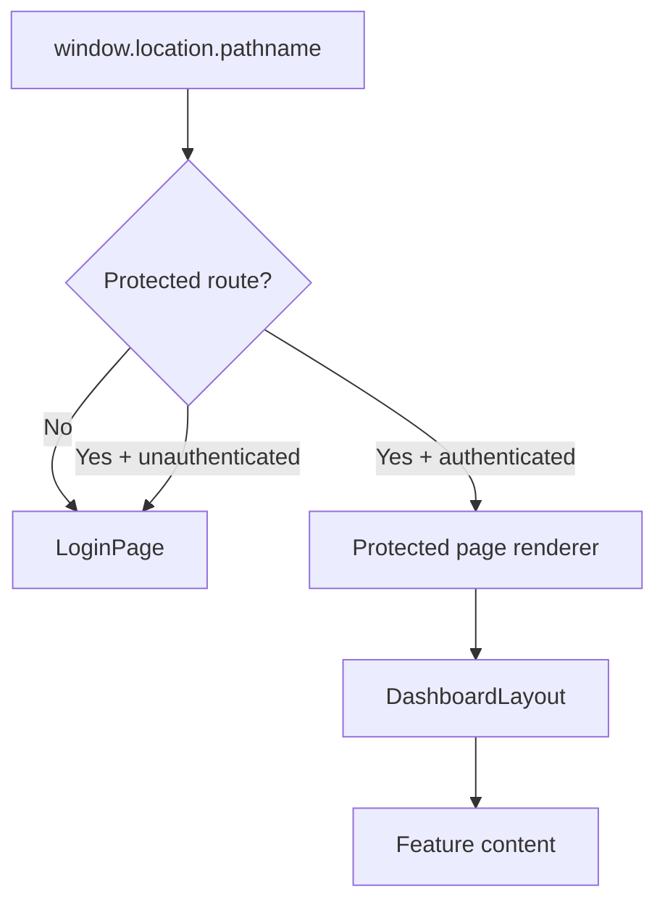

# Tasleem Lite Architecture

## Project Overview

Tasleem Lite is a frontend-only ERP MVP for domestic shipping operations. The
current application provides a branded login experience, protected dashboard
shell, Master Data modules, a Settings module for shipment statuses, and
Pricing Engine and Shipments UI foundations.

The codebase currently contains no backend, database, API integration,
production authentication, authorization, business logic, workflow engine, or
automatic calculations.

## Technology Stack

- React
- Vite
- TypeScript
- Tailwind CSS
- shadcn/ui-style components
- lucide-react icons
- react-i18next
- i18next
- localStorage for frontend-only demo authentication

## Folder Structure

```text
src/
  app/                 Protected page wrappers used by App.tsx
  components/
    auth/              Login form
    brand/             Logo component
    company/           Company module UI
    couriers/          Couriers module UI
    dashboard/         Dashboard content
    language/          Language switcher
    pricing-engine/    Pricing Engine UI and subcomponents
    senders/           Senders module UI
    shipments/         Shipments module UI and subcomponents
    shared/            Reusable ERP UI components
    shipment-statuses/ Shipment Statuses module UI
    ui/                shadcn/ui primitives
  config/              Navigation and route metadata
  constants/           Shared UI constants
  i18n/                i18next setup and locale resources
  layouts/             Dashboard shell
  lib/                 Utility and demo auth helpers
  mocks/               Static demo data
  pages/               Public login page
  types/               Shared TypeScript types
docs/                  Project documentation
public/                Static assets, including logo.png
```

## Routing Architecture

Routing is implemented manually in `src/App.tsx`; React Router is not used.



Protected paths are defined in `src/config/navigation.ts` and checked through
`isProtectedRoutePath`. `App.tsx` maps each protected route to a page wrapper
component from `src/app`.

Current protected routes:

- `/dashboard`
- `/company`
- `/senders`
- `/couriers`
- `/pricing-engine`
- `/shipments`
- `/shipment-statuses`

The public route is `/`.

## Navigation Architecture

Navigation is centralized in `src/config/navigation.ts`.

Each navigation item defines:

- `id`
- `path`
- translation key
- icon
- sidebar group
- protected state
- enabled state

The dashboard sidebar is derived from this configuration in
`src/layouts/dashboard-layout.tsx`. Placeholder groups exist for Operations,
Accounting, and Reports, but they are disabled and have no functionality.

Current sidebar groups:

- Dashboard
- Master Data
- Operations
- Accounting
- Reports
- Settings

## Shared Component Architecture

Shared ERP components live in `src/components/shared`.

- `PageHeader`: page title, description, badge/action areas.
- `StatsGrid`: responsive grid for statistic cards.
- `StatCard`: generic metric card.
- `SearchToolbar`: reusable search and filter wrapper.
- `DataTableContainer`: table frame with header, badge, and empty-state support.
- `EmptyState`: reusable placeholder content.
- `FormSection`: form grouping with title, description, separator, and icon.

Low-level UI primitives live in `src/components/ui` and are used by modules and
shared components.

## Feature Module Architecture

Feature modules are organized under `src/components/<feature>`.

Current modules:

- `company`
- `senders`
- `couriers`
- `shipment-statuses`
- `pricing-engine`
- `shipments`

Protected wrappers live under `src/app` and mount feature content inside
`DashboardLayout`.

Pattern:

```text
src/app/<module>-preview.tsx
  -> DashboardLayout
    -> src/components/<module>/<module>-content.tsx
```

Dialogs are colocated with their feature modules.

The Pricing Engine is split into focused subcomponents:

- `pricing-engine-content.tsx`
- `price-lists-table.tsx`
- `price-list-details.tsx`
- `pricing-bulk-actions.tsx`
- `future-placeholder-cards.tsx`
- `price-list-dialog.tsx`

The Shipments module is split into focused subcomponents:

- `shipments-content.tsx`
- `shipment-stats.tsx`
- `shipment-filters.tsx`
- `shipments-table.tsx`
- `shipment-dialog.tsx`
- `shipment-details-sheet.tsx`
- `shipment-timeline.tsx`

## Mock Data Architecture

Static demo data lives in `src/mocks`.

Current mock files:

- `company.ts`
- `senders.ts`
- `couriers.ts`
- `shipment-statuses.ts`
- `pricing-engine.ts`
- `shipments.ts`

Mocks are UI-only and do not persist or calculate values. Components import
mock data directly for display.

Pricing Engine price rows reference Shipment Status IDs. Shipment Status records
remain the source of whether a status appears in price lists through the
`usedInPriceList` flag.

## Type System

Shared TypeScript types live in `src/types`.

Current type files:

- `common.ts`
- `company.ts`
- `sender.ts`
- `courier.ts`
- `shipment-status.ts`
- `shipment.ts`
- `price-list.ts`
- `location.ts`
- `index.ts`

The type layer currently models UI/demo data structures. It does not define
backend contracts or validation schemas.

## Internationalization (i18n)

i18n is implemented with `react-i18next` and `i18next`.

Locale resources live in:

```text
src/i18n/locales/ar/
src/i18n/locales/en/
```

Namespaces are registered in `src/i18n/resources.ts`.

Arabic is the default language. Document direction is set automatically through
`getLanguageDirection` in `src/i18n/index.ts` and applied in `App.tsx`.

All user-facing module text is expected to come from translation files.

## Styling & Branding

Styling uses Tailwind CSS with shadcn/ui-style primitives.

Branding:

- Dark blue
- White
- Orange
- Logo asset: `public/logo.png`

`BrandLogo` centralizes logo display. The dashboard layout and login page reuse
the same branding language.

## Reusable UI Patterns

Implemented patterns:

- Protected shell through `DashboardLayout`.
- Page-level `PageHeader`.
- Search/filter areas through `SearchToolbar`.
- Tables wrapped by `DataTableContainer`.
- Disabled Save buttons for UI-only dialogs.
- Demo-data badges.
- UI-only badges.
- Form grouping through `FormSection`.
- Feature dialogs colocated with modules.
- Mock data imported from `src/mocks`.
- Shared domain/UI types imported from `src/types`.
- Shared pricing option constants imported from `src/constants`.

## Naming Conventions

- Component files use kebab-case: `pricing-engine-content.tsx`.
- Component exports use PascalCase: `PricingEngineContent`.
- Translation namespaces use feature names: `pricingEngine`, `shipmentStatuses`.
- Mock exports use descriptive plural names: `priceLists`, `senders`.
- Constants use uppercase names where they represent fixed option sets.
- Route paths use kebab-case: `/pricing-engine`.

## Current Module Structure

```text
Dashboard
  /dashboard

Master Data
  /company
  /senders
  /couriers
  /pricing-engine

Settings
  /shipment-statuses
```

Operations, Accounting, and Reports currently contain disabled placeholders
only.

## Documentation Structure

Current documentation files:

- `PROJECT_CONTEXT.md`
- `docs/ARCHITECTURE.md`
- `docs/ROADMAP.md`
- `docs/DATABASE.md`
- `docs/BUSINESS_RULES.md`
- `docs/UI_GUIDELINES.md`
- `docs/CHANGELOG.md`
- `docs/PROJECT_CONTEXT.md`

`docs/ARCHITECTURE.md` is intended to be the architecture source of truth.

## Architectural Decisions Already Implemented

- Frontend-only MVP implementation.
- Manual routing without React Router.
- Central navigation configuration.
- Protected route detection derived from navigation configuration.
- Dashboard shell reused by all protected modules.
- shadcn/ui-style primitives used as the UI foundation.
- Feature modules kept under `src/components/<feature>`.
- Static demo data moved to `src/mocks`.
- Reusable TypeScript types moved to `src/types`.
- Pricing strategy options moved to shared constants.
- Pricing Engine split into table, details, bulk action, future placeholder, and
  dialog subcomponents.
- Pricing Engine status rows reference Shipment Status IDs and filter by
  `usedInPriceList`.
- Arabic/English translation namespaces per module.
- RTL/LTR document direction handled automatically.
- Authentication is localStorage-only demo authentication.

## Current Limitations

- No backend, database, API, or persistence exists.
- No production authentication or authorization exists.
- No business logic or calculations exist.
- Routing is manual and requires updating `App.tsx` for each new protected page.
- Pricing Engine details currently use static mock pricing amounts.
- Search and filter controls are UI placeholders only.
- Dialog Save buttons are disabled placeholders.
- Placeholder sidebar items have no functionality.
- Some repeated labels still exist in feature namespaces.

## Technical Debt

- `App.tsx` still owns the protected route renderer map separately from the
  navigation config.
- Sender dialog still imports price list mock records for its custom price list
  selector.
- Some table labels remain module-local where they are not yet shared across
  modules.
- Arabic locale files should be periodically verified for encoding consistency.

## Recommendations Before Shipments

- Decouple Sender custom price list selection from Pricing Engine mock records
  if a broader shared pricing selector is needed.
- Continue centralizing repeated table/action labels in the common namespace when
  they are reused by Shipments.
- Consider a small route/module registry to reduce duplicate route wiring in
  `App.tsx`.
- Add shipment-focused types and mocks before building Shipment UI screens.
- Keep Shipment UI strictly frontend-only until backend/API work is explicitly
  approved.
